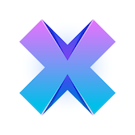

# AXEwallet

[](https://travis-ci.com/AXErunners/axewallet-ios) [](https://github.com/AXErunners/axewallet-ios)

<p align="center" >

</p>
<p align="center" >
<a href="https://itunes.apple.com/app/axe-wallet/id1430269763"></a>
</p>

Axewallet (dashwallet fork) is a real standalone AXE client. There is no server to get hacked or go down, so you can always access your money.
Using [SPV](https://en.bitcoin.it/wiki/Thin_Client_Security#Header-Only_Clients) mode, Axewallet connects directly to the AXE network with the fast performance you need on a mobile device.

## Features

- ["simplified payment verification"](https://github.com/AXErunners/axe/wiki/SPV) for fast mobile performance
- no server to get hacked or go down
- single backup phrase that works forever
- private keys never leave your device
- import password protected paper wallets
- "payment protocol” payee identity certification

## Getting Started

To run *Axe Wallet* iOS app on your device or simulator clone the repo and make sure you installed needed [Requirements](#Requirements).
Then run `pod install` in the cloned directory.
Open `AxeWallet.xcworkspace` in Xcode and run the project.

## Requirements

- Xcode 11
- Dependency manager [CocoaPods](https://cocoapods.org). Install via `gem install cocoapods`

### Axe wallet Requirements

Currently, Axe wallet is under active development so it requires a few additional steps to make it work.

1. Clone [AxeSync](https://github.com/axerunners/axesync) and [dapi-grpc](https://github.com/axerunners/dapi-grpc) repositories:
`git clone https://github.com/axerunners/axesync.git --branch development AxeSync`
`git clone https://github.com/axerunners/dapi-grpc.git dapi-grpc`

To simplify developing process we use local podspec dependencies and it's important to preserve the following folder structure:
```
../AxeSync/
../dapi-grpc/
../axewallet-ios/
```

2. Install protobuf and grpc:
`brew install protobuf grpc`

3. Run `pod install` in the wallet directory.

### Optional Requirements

#### Objective-C Related
- Formatting tools: [clang-format](https://clang.llvm.org/docs/ClangFormat.html). Install via `brew install clang-format`.

#### Swift Related
- [SwiftFormat](https://github.com/nicklockwood/SwiftFormat). Install via `brew install swiftformat`. 
- [SwiftLint](https://github.com/realm/SwiftLint).  Install via `brew install swiftlint`.

#### Localization

- Localized files helper tool [BartyCrouch](https://github.com/Flinesoft/BartyCrouch). Install via `brew install bartycrouch`.

## Contribution Guidelines

We use Objective-C for developing iOS App and underlying [AxeSync](https://github.com/axerunners/axesync-iOS) library and Swift for the Watch App.

General information on developing conventions you can find at [Apple Developer Portal](https://developer.apple.com/library/archive/documentation/Cocoa/Conceptual/ProgrammingWithObjectiveC/Conventions/Conventions.html).
For more specific Objective-C guidelines we stick with [NYTimes Objective-C Style Guide](https://github.com/nytimes/objective-c-style-guide).

Our code style is enforced by [clang-format](#Objective-C-Related) and [SwiftFormat / SwiftLint](#Swift-Related).

## Documentation

Official Axe documentation is available [here](https://docs.axe.org).

## WARNING

Installation on jailbroken devices is strongly discouraged.

Any jailbreak app can grant itself access to every other app's keychain data and rob you by self-signing as described [here](http://www.saurik.com/id/8) and including `<key>application-identifier</key><string>*</string>` in its .entitlements file.

## License

*AXE Wallet* is available under the MIT license. See the LICENSE file for more info.
